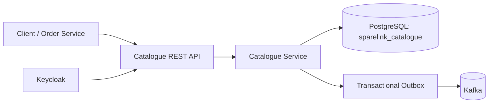

# SpareLink Catalogue Service

[](https://github.com/tadiwanashe-mashongwa/catalogue-service/actions/workflows/ci.yml)


The Catalogue Service is SpareLink's source of truth for automotive spare-part data. It manages parts, brands, categories, compatible vehicles, prices, and part availability for the wider platform.

## Capabilities

- CRUD operations for parts, brands, and categories.
- Paginated part catalogue with optional brand, category, status, and keyword filters.
- Vehicle compatibility search by make, model, and year.
- Bean validation and consistent problem-detail error responses.
- Optimistic locking prevents stale part updates from overwriting newer data.
- PostgreSQL persistence with Flyway-managed schema migrations.
- Transactional outbox support for reliable catalogue events.
- JWT resource-server security for catalogue mutations.
- Health checks, OpenAPI documentation, Testcontainers, and Kafka integration tests.

## Architecture



The service owns its `sparelink_catalogue` database. Other SpareLink services integrate through its API or published events; they do not share its tables.

## API

Base URL: `http://localhost:8081`

| Method | Endpoint | Description |
| --- | --- | --- |
| `GET` | `/api/parts` | List parts with pagination and filters. |
| `POST` | `/api/parts` | Create a part. |
| `GET` | `/api/parts/{id}` | Get a part. |
| `PUT` | `/api/parts/{id}` | Update a part using its current version. |
| `DELETE` | `/api/parts/{id}` | Delete a part. |
| `GET` | `/api/parts/search?keyword=brake` | Search parts by keyword. |
| `GET` | `/api/parts/vehicle?make=Toyota&model=Corolla&year=2020` | Find vehicle-compatible parts. |
| `GET, POST, PUT, DELETE` | `/api/brands` | Manage brands. |
| `GET, POST, PUT, DELETE` | `/api/categories` | Manage categories. |

Example catalogue query:

```http
GET /api/parts?page=0&size=20&brandId={uuid}&categoryId={uuid}&status=ACTIVE&keyword=brake
```

`page` is zero-based and `size` must be between 1 and 100.

Interactive API documentation is available at [Swagger UI](http://localhost:8081/swagger-ui/index.html). The OpenAPI document is exposed at `/v3/api-docs`.

## Security

Read endpoints are public. Creating, updating, and deleting catalogue data require a valid JWT issued by the SpareLink Keycloak realm. Configure the issuer with:

```properties
KEYCLOAK_ISSUER_URI=http://localhost:8080/realms/sparelink
```

## Run locally

Prerequisites: Java 17+, Docker Desktop, and Maven Wrapper support.

Start the SpareLink infrastructure from the platform root:

```powershell
docker compose up -d
```

Then start this service:

```powershell
.\mvnw.cmd spring-boot:run
```

For a local PostgreSQL instance, the default datasource is `jdbc:postgresql://localhost:5432/sparelink_catalogue` with user `postgres`. Override configuration with environment variables or Spring properties as needed.

## Database migrations

Flyway applies migrations from `src/main/resources/db/migration` at startup. Hibernate validates the schema; it does not create or alter production tables.

## Testing and coverage

The test suite covers unit, controller, repository, service, Kafka outbox, security, and integration scenarios. PostgreSQL and Kafka integration tests run against Testcontainers.

```powershell
.\mvnw.cmd test
```

The command also generates a JaCoCo report at `target/site/jacoco/index.html`. GitHub Actions runs the same suite on pushes and pull requests, uploads the report, and refreshes the coverage badge after successful pushes to `main`.

## Observability

```http
GET /actuator/health
GET /actuator/info
```

These endpoints are intentionally public for container orchestration and monitoring.
